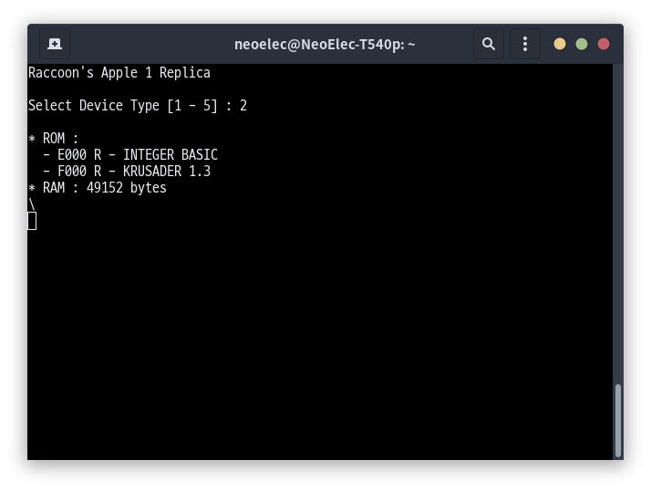

# Raccoon's APPLE 1 Replica on Arduino

## Supoorted Device Types

|#|Descriotion|
|-|-|
|1|INTEGER BASIC|
|2|INTEGER BASIC + KRUSADER 1.3|
|3|INTEGER BASIC + APPLE-II MONITOR|
|4|INTEGER BASIC + KRUSADER 1.3 + OSI 6502 BASIC|
|5|INTEGER BASIC + KRUSADER 1.3 + TINY BASIC|

## Screenshot

